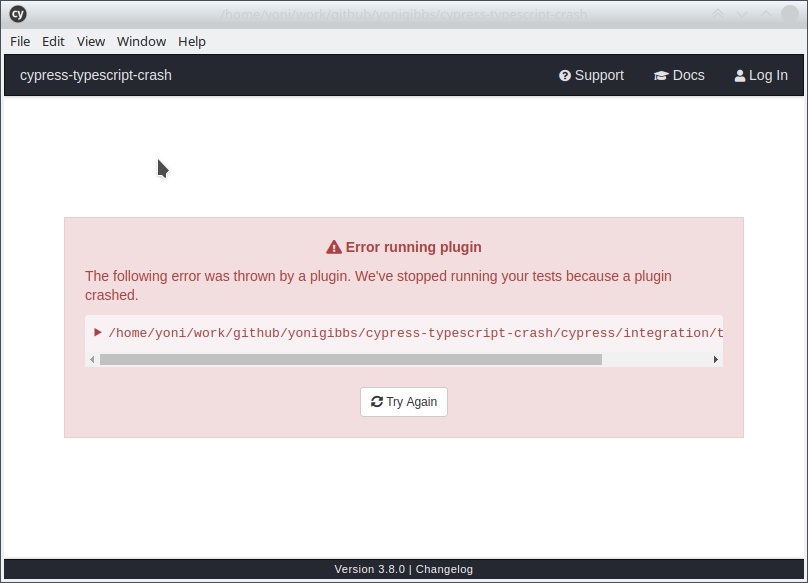
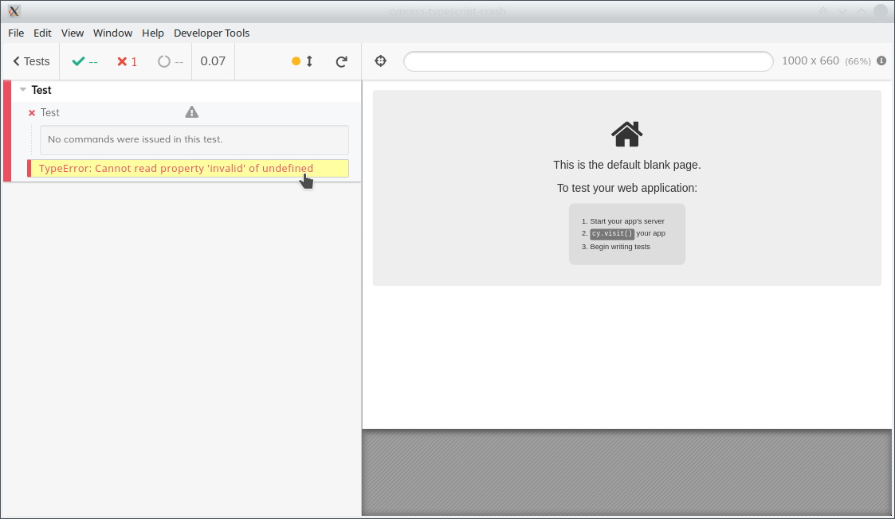

# cypress-typescript-crash
Cut down repo showing TypeScript &amp; Cypress with
[add-typescript-to-cypress](https://github.com/bahmutov/add-typescript-to-cypress) plugin.

This repository is used to demonstrate Cypress crashing when the TypeScript code is saved in a non-compiling state at
any point.

To reproduce the issue, do the following:
1. Run `npm run cypress:open`. This will launch the Cypress UI.
1. Click on `typescript.spec.ts` to open that test in the Cypress UI.
1. The test should automatically run successfully. (It simply visits the Cypress home page.)
1. Locally edit the source code of this test (`/cypress/integration/typescript.spec.ts`) and leave it in a non-compiling
state, e.g. by adding the `.something.invalid()` call shown below:

        context("Test", () => {
            it("Test", () => {
                cy.visit("www.cypress.io").contains("cypress").something.invalid()
            })
        })

1. Return to the Cypress UI. Assuming it's nothing environmental, and the issue does reproduce on your system, you'll
notice that:
   * The window which had the test open will have closed
   * The main Cypress window will show the following error:
   

Repeating the same steps as above with the JavaScript spec doesn't exhibit the same problem. Here, when the code is
invalid, it's handled correctly in the window which showed the test results:
   
